# 🗳️ Voting System (UI)

Voting System UI is a responsive web-based interface built with **Vue.js** for creating, managing, and participating in online voting.  
This project focuses on the front-end experience, including poll creation, user login, and real-time result display.

---

## 📌 Key Features
- **User Interface for Authentication**
  - Registration and login pages.
  - Smooth navigation between pages.
- **Poll Management**
  - Create new polls with title, description, and expiration date.
  - Add multiple poll options.
  - Enable/disable polls from the UI.
- **Voting**
  - Users can choose an option in active polls.
  - Prevent duplicate selections through UI validation.
- **Results & Statistics**
  - Display vote counts for each option.
  - Show results in real time.

---

## 🛠️ Technologies Used
- **Frontend**: [Vue.js](https://vuejs.org/) + HTML/CSS
- **Styling**: Custom CSS & responsive design
- **Icons**: [Font Awesome](https://fontawesome.com/) (optional)

---

## 📸 Screenshots
### 🏠 Home

  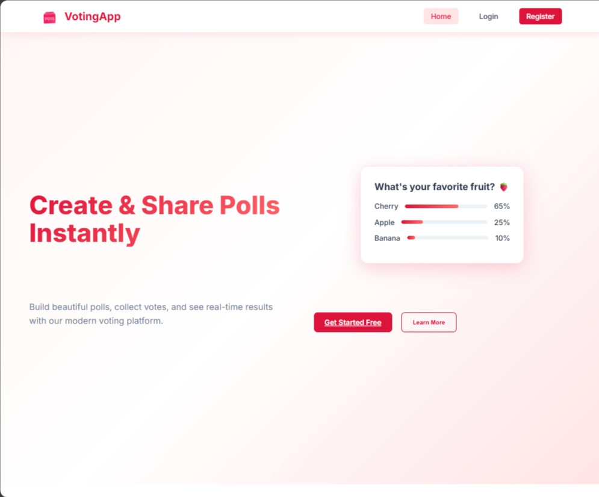
  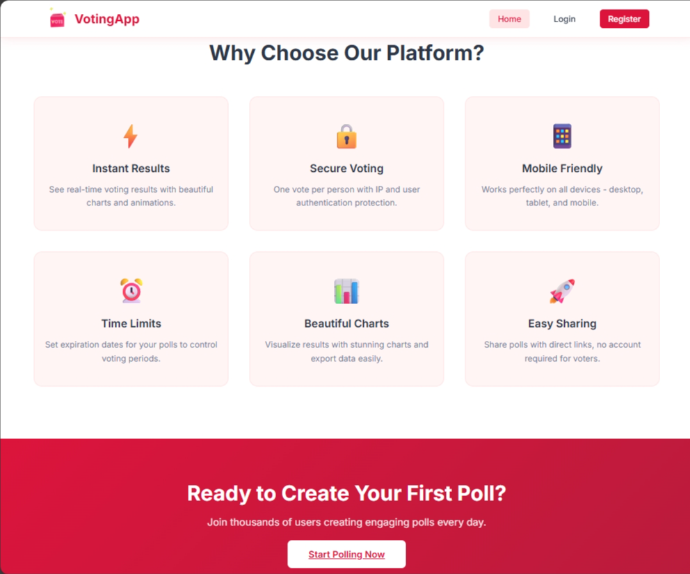
  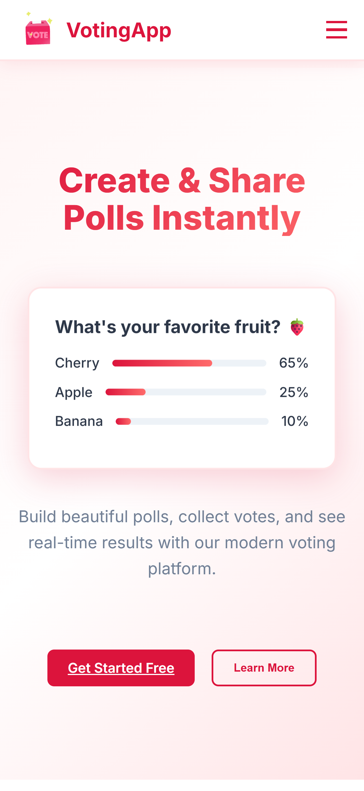

---
### 🔍 Access

  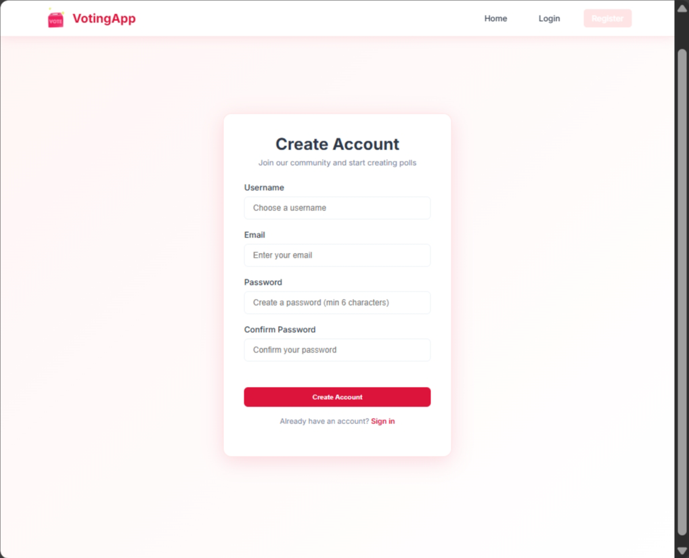
  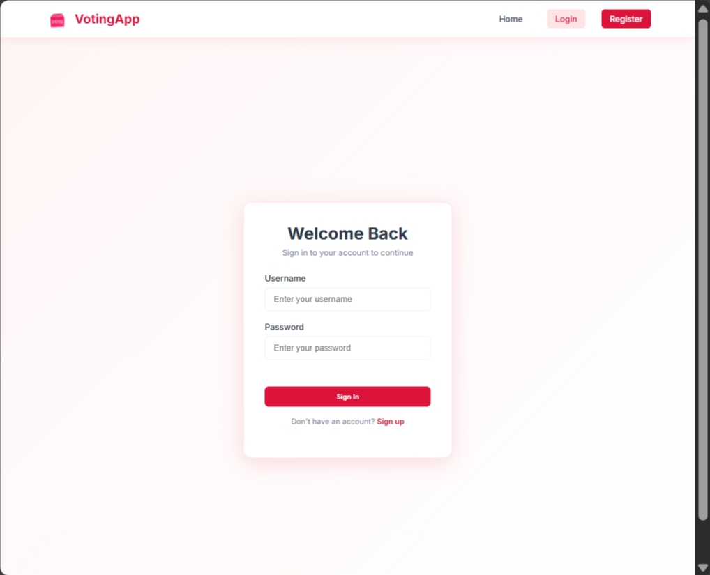
   
  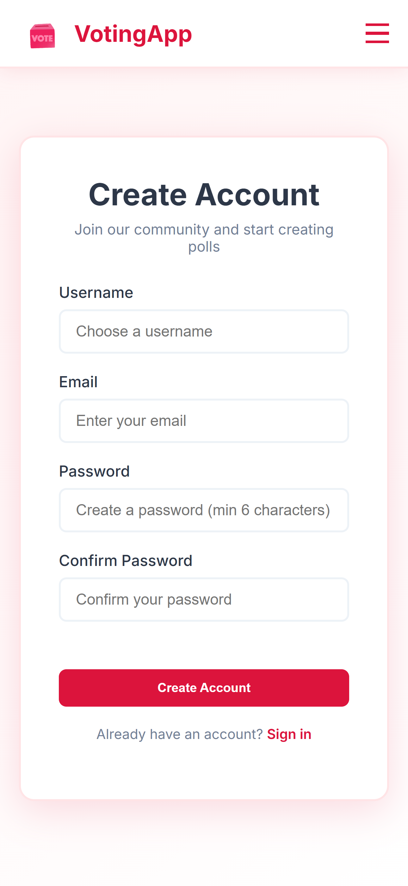
  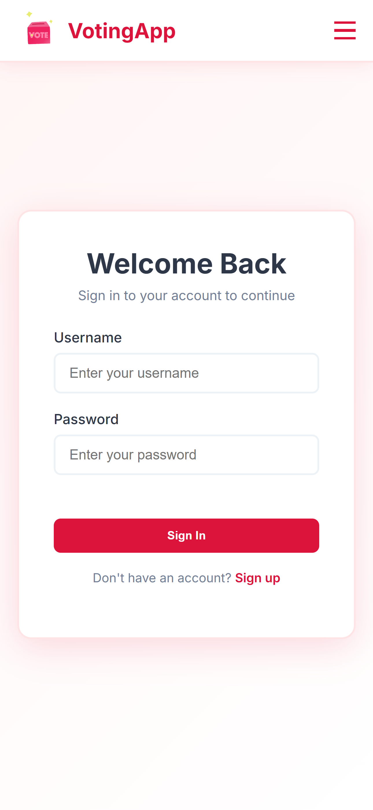

---
### 💭 All Pages

  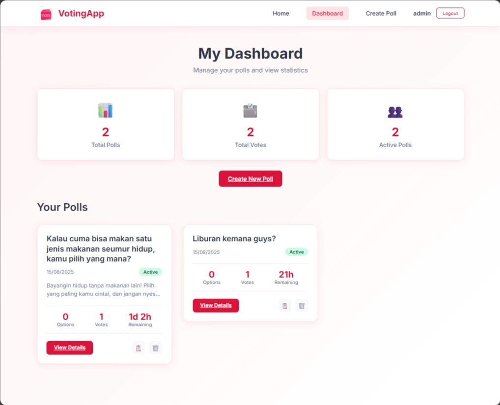
  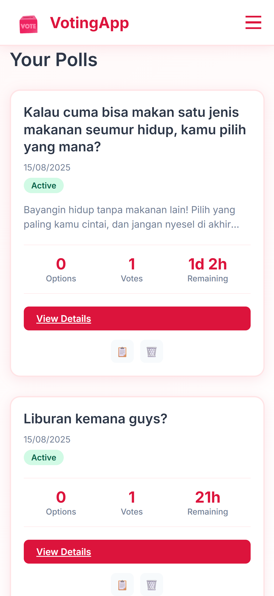
  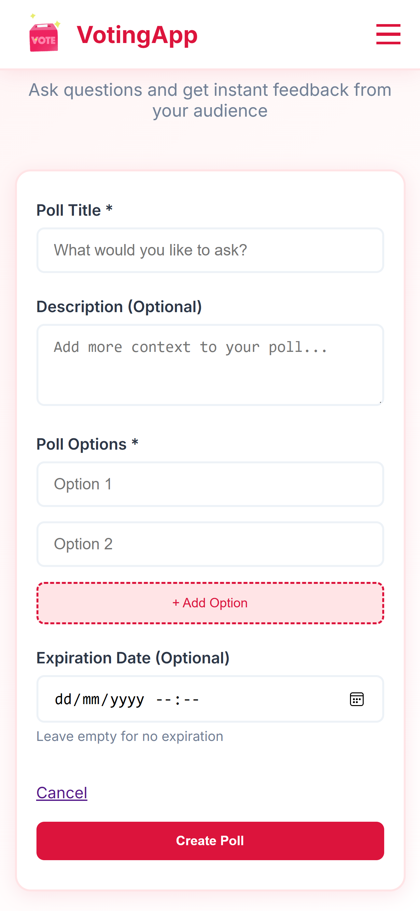
  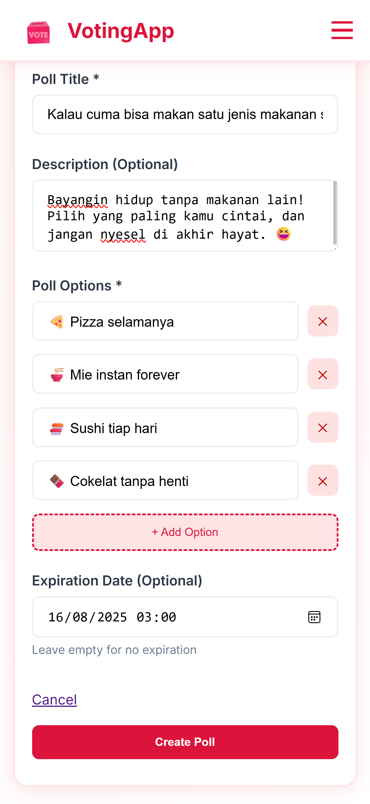
  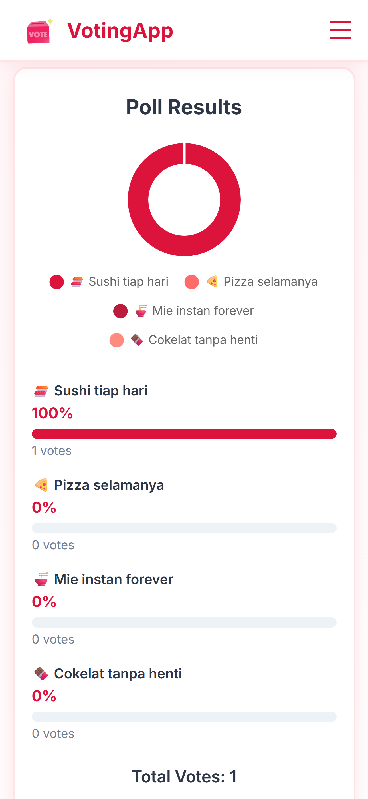

---

## 👩‍💻 About the Developer

By **Dewi Atika Muthi**  
📍 _Informatics Student, Telkom University_  
📧 **Email:** detikaa10@fmail.com  
🌐 **GitHub:** [@tikature](https://github.com/tikature)  

💬 *"Design with simplicity, build with purpose."*

